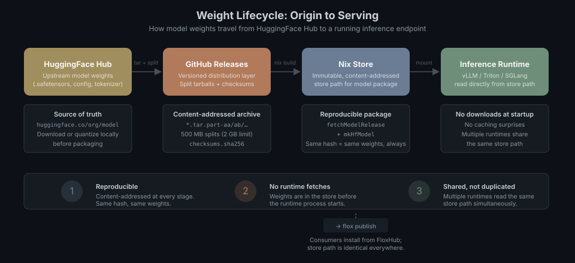
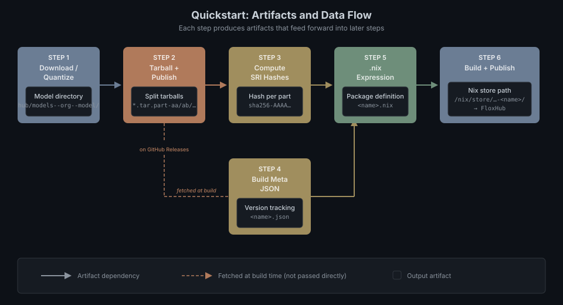
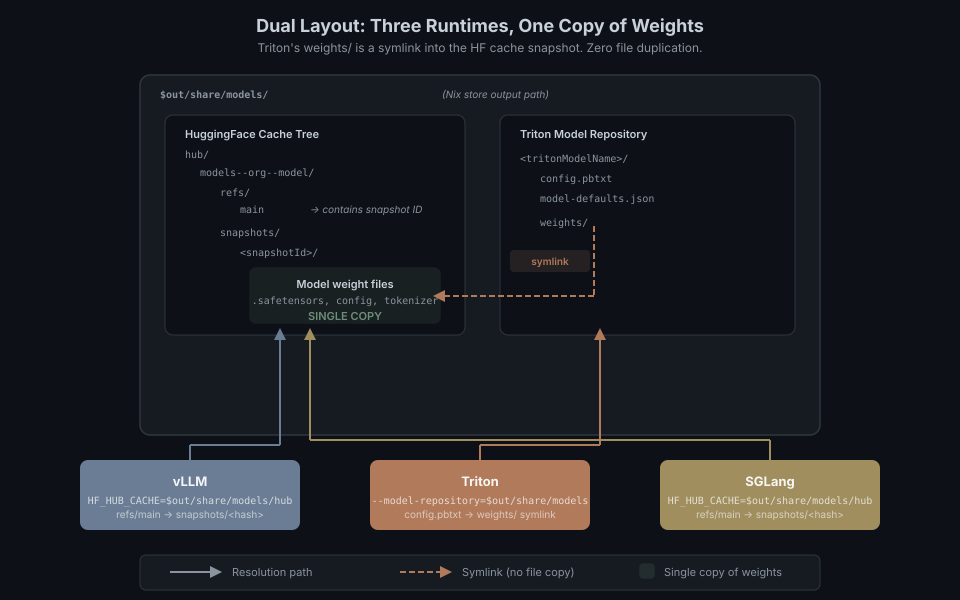

# package-hf-models

Packages HuggingFace model weights into immutable [Nix store](https://nix.dev/manual/nix/stable/store/) paths for serving by [vLLM](https://docs.vllm.ai/), [Triton Inference Server](https://github.com/triton-inference-server/server) (vLLM backend), and [SGLang](https://sgl-project.github.io/).

### Why package weights in Nix?

LLM inference runtimes typically download model weights at startup — from HuggingFace Hub, S3, or a shared filesystem. This is slow, non-reproducible, and hard to version. By packaging weights into the Nix store, every deployment gets an identical, content-addressed directory of model files. The same Nix hash always contains exactly the same weights. Runtimes mount the store path directly — no downloads, no caching surprises, no "works on my machine."

Because the Nix store is a shared, content-addressed filesystem, multiple runtimes can serve the same model simultaneously from a single store path — no duplication, no image builds, no network fetches at startup. A vLLM instance, a Triton server, and an SGLang worker can all read from the same `/nix/store/…` directory at the same time without copying weights into separate containers, VM images, or runtime caches.



## Quickstart: package your own model

This walkthrough takes you from a set of HuggingFace model weights to a published, reproducible Nix package.



### Step 1 — Download or quantize weights

Get the model files into a local staging directory.

- **For dual layout** (serves vLLM, SGLang, *and* Triton from one package): use the HuggingFace cache structure — `hub/models--<org>--<model>/` with a `snapshots/<hash>/` subdirectory containing the actual files.
- **For single layout** (Triton-only): use a flat directory with all symlinks resolved.

Not sure which layout to pick? See [Choosing a layout](#choosing-a-layout-vllm-vs-triton) below. When in doubt, use dual — it works everywhere.

### Step 2 — Create a tarball and publish to GitHub Releases

Model weights are stored as split tarballs on GitHub Releases (see [Weight source](#weight-source--github-releases) for details). Split at 500 MB to stay under the 2 GB per-asset limit:

```bash
# Resolve symlinks (-h) and split at 500 MB:
tar -chf - <model-dir>/ | split -b 500M - <name>.tar.part-
sha256sum *.tar.part-* > checksums.sha256

# Publish (requires gh CLI):
gh release create <name>-v1.0 *.tar.part-* checksums.sha256 \
  --repo flox/package-hf-models --title "<title>" --notes "<notes>"
```

### Step 3 — Compute Nix SRI hashes

You'll need one hash per split part for the `.nix` file:

```bash
for f in *.tar.part-*; do echo "$f $(nix hash file --sri $f)"; done
```

### Step 4 — Create `build-meta/<name>.json`

This file tracks the package's build version independently of git:

```json
{
  "build_version": 1,
  "force_increment": 0,
  "git_rev": "<current git rev>",
  "git_rev_short": "<short rev>",
  "changelog": "Initial package."
}
```

### Step 5 — Create `.flox/pkgs/<name>.nix`

This is the Nix expression that assembles everything into a store path. Pick the template that matches your layout.

#### Single layout template (Triton-only)

Use this when only Triton needs to serve the model. Simpler, no HF cache tree.

```nix
{ pkgs, mkHfModel ? pkgs.callPackage ./mkHfModel.nix {},
  fetchModelRelease ? pkgs.callPackage ./fetchModelRelease.nix {} }:

let
  buildMeta = builtins.fromJSON (builtins.readFile ../../build-meta/<NAME>.json);

  modelSrc = fetchModelRelease {
    name = "<NAME>-src";
    parts = [
      { url = "https://github.com/<org>/<repo>/releases/download/<tag>/<name>.tar.part-aa"; hash = "sha256-AAAA..."; }
      # one entry per split part — paste the hashes from Step 3
    ];
  };
in
mkHfModel {
  pname   = "<NAME>";               # Nix package name (e.g. "phi-4-mini-instruct-fp8-hf")
  baseVersion = "1.0.0";
  inherit buildMeta;
  srcPath = "${modelSrc}/<tar-top-level-dir>";    # directory inside the extracted tarball
  tritonModelName = "<triton_name>";              # Triton model-repository directory name

  vllmDefaults = {
    gpu_memory_utilization = 0.85;   # fraction of GPU VRAM vLLM may use
    max_model_len          = 4096;   # max total tokens (prompt + completion)
    dtype                  = "auto"; # "auto", "float16", "bfloat16"
    enable_log_requests    = false;
    # quantization = "awq";          # uncomment if weights are quantized
  };
}
```

#### Dual layout template (vLLM + SGLang + Triton)

Use this when you want one package that works with all three runtimes. Requires two extra fields — `slug` (the HuggingFace model path with `/` replaced by `--`) and `snapshotId` (the HuggingFace commit hash that pins the snapshot).

```nix
{ pkgs, mkHfModel ? pkgs.callPackage ./mkHfModel.nix {},
  fetchModelRelease ? pkgs.callPackage ./fetchModelRelease.nix {} }:

let
  buildMeta = builtins.fromJSON (builtins.readFile ../../build-meta/<NAME>.json);

  modelSrc = fetchModelRelease {
    name = "<NAME>-src";
    parts = [
      { url = "https://github.com/<org>/<repo>/releases/download/<tag>/<name>.tar.part-aa"; hash = "sha256-AAAA..."; }
      # one entry per split part — paste the hashes from Step 3
    ];
  };
in
mkHfModel {
  pname   = "<NAME>";
  baseVersion = "1.0.0";
  inherit buildMeta;
  srcPath = "${modelSrc}/<tar-top-level-dir>";
  tritonModelName = "<triton_name>";

  # These two fields enable the dual layout (HF cache + Triton):
  slug       = "<org>--<model>";        # e.g. "microsoft--Phi-3.5-mini-instruct-AWQ"
  snapshotId = "<hf-commit-hash>";      # e.g. "d9795a43c4d5..."

  vllmDefaults = {
    gpu_memory_utilization = 0.85;
    max_model_len          = 4096;
    dtype                  = "float16";
    quantization           = "awq";     # match your quantization method
    enable_log_requests    = false;
  };
}
```

### Step 6 — Build and verify

```bash
# Build the package:
flox build <name>

# Inspect the output layout:
ls -la result-<name>/share/models/

# Publish to FloxHub:
flox publish
```

For an end-to-end real example, see [`phi-4-mini-instruct-fp8-hf.nix`](.flox/pkgs/phi-4-mini-instruct-fp8-hf.nix) (single layout) or [`vllm-phi-3-5-mini-instruct-awq.nix`](.flox/pkgs/vllm-phi-3-5-mini-instruct-awq.nix) (dual layout).

### Step 7 — Serve the resultant package

#### With a Flox runtime

Each Flox runtime has its own model-resolution logic. Install your model package, set one or two env vars, and the runtime finds the weights automatically.

**vLLM** ([vllm-flox-runtime](https://github.com/flox/vllm-flox-runtime)) — requires dual layout:

Add the package to the runtime's `manifest.toml`:

```toml
[install]
my-model.pkg-path = "flox/<package-name>"
my-model.systems  = ["x86_64-linux"]
```

Activate with the `flox` source enabled (the runtime's default `VLLM_MODEL_SOURCES` is `local,hf-cache,hf-hub` — you must add `flox` to the front so it finds Nix-installed packages at `$FLOX_ENV/share/models/hub/`):

```bash
VLLM_MODEL=<Model-Name> VLLM_MODEL_ORG=<org> VLLM_MODEL_SOURCES=flox,local,hf-cache,hf-hub flox activate
```

**SGLang** ([sglang-runtime](https://github.com/flox/sglang-runtime)) — requires dual or HF-only layout:

Add the package to `manifest.toml` the same way, then activate:

```bash
SGLANG_MODEL=<org>/<Model-Name> flox activate
```

No source-chain configuration needed — `sglang-resolve-model` automatically checks `$FLOX_ENV/share/models/hub/` for a matching HF cache snapshot before falling back to a download.

**Triton** ([triton-trtllm-flox-runtime](https://github.com/flox/triton-trtllm-flox-runtime)) — any layout:

Add the package to `manifest.toml` the same way, then activate:

```bash
TRITON_MODEL=<tritonModelName> flox activate
```

The `flox` source is already first in the default `TRITON_MODEL_SOURCES` chain (`flox,local,r2,hf-hub`), so no extra configuration is needed.

#### Without a Flox runtime (BYO)

If you run vLLM, SGLang, or Triton outside of a Flox runtime, point them at the build output directly:

```bash
# vLLM or SGLang — point at the HF cache tree (dual layout required):
HF_HUB_CACHE=result-<name>/share/models/hub vllm serve <org>/<Model-Name>

# Triton — point at the model repository (any layout):
tritonserver --model-repository=result-<name>/share/models
```

Dual layout is required for vLLM and SGLang (they use HuggingFace's cache resolution internally). Triton works with either layout.

## Choosing a layout: vLLM vs Triton

vLLM and SGLang expect model files in the **HuggingFace cache layout** — the directory tree that HuggingFace's `huggingface_hub` Python library creates when it downloads a model (`hub/models--<slug>/snapshots/<hash>/`). Triton Inference Server expects a completely different structure — a **model repository** where each model lives in a directory with a `config.pbtxt` file and a `weights/` subdirectory.

If you only serve via Triton, the **single layout** is simpler — weight files are copied directly into a `weights/` directory under the Triton model name. If you want one package that works with all three runtimes, the **dual layout** creates both structures with zero file duplication: weight files live once in the HF cache tree, and Triton's `weights/` directory is a symlink into it.

### Single layout (Triton-only)

Weight files are copied directly into a `weights/` directory:

```
$out/share/models/<tritonModelName>/
  config.pbtxt            # tells Triton to use the vLLM backend
  model-defaults.json     # vLLM engine parameters (GPU memory, max length, dtype, etc.)
  weights/                # model files (tensors, tokenizer, config) copied here
```

Triton scans `$out/share/models/`, finds the `<tritonModelName>/` directory with its `config.pbtxt`, and serves the model.

### Dual layout (vLLM + Triton)

The builder creates a full HuggingFace cache tree and points Triton at it via symlink — so there's only one copy of the (often multi-gigabyte) weight files:

```
$out/share/models/hub/models--<slug>/
  refs/main                          # text file containing the snapshot ID
  snapshots/<snapshotId>/            # the actual model files (single copy)

$out/share/models/<tritonModelName>/
  config.pbtxt                       # Triton config (same as single layout)
  model-defaults.json                # vLLM engine parameters
  weights -> ../hub/models--<slug>/snapshots/<snapshotId>   # symlink, not a copy
```

In the diagram above:
- **`$out`** is the Nix store output path (e.g. `/nix/store/abc123-phi-4-mini-instruct-fp8-hf-1.0.2/`).
- **Slug** is the HuggingFace model path with `/` replaced by `--` (e.g. `microsoft/Phi-4-mini-instruct` → `microsoft--Phi-4-mini-instruct`).
- **Snapshot ID** is a commit hash from HuggingFace Hub that pins a specific version of the model weights.

**How this works for each runtime:**

- **vLLM / SGLang:** Set the environment variable `HF_HUB_CACHE=$out/share/models/hub`. These runtimes use HuggingFace's library internally, which follows the `refs/main` → `snapshots/<hash>` chain to find model files — exactly as if the model had been downloaded normally.
- **Triton:** Set `--model-repository=$out/share/models`. Triton sees `<tritonModelName>/config.pbtxt` and follows the `weights/` symlink to reach the same files. It doesn't know or care about the HF cache structure.

Zero file duplication — both runtimes read from the same snapshot directory.



## The shared builder — `mkHfModel.nix`

All standard model packages are built by calling [`mkHfModel`](.flox/pkgs/mkHfModel.nix). Here's a real example (Phi-3.5-mini-instruct AWQ, dual layout):

```nix
{ pkgs, mkHfModel ? pkgs.callPackage ./mkHfModel.nix {},
  fetchModelRelease ? pkgs.callPackage ./fetchModelRelease.nix {} }:
let
  buildMeta = builtins.fromJSON (builtins.readFile ../../build-meta/phi-3-5-mini-instruct-awq.json);
  modelSrc = fetchModelRelease {
    name = "phi-3-5-mini-instruct-awq-src";
    parts = [
      { url = "https://github.com/flox/package-hf-models/releases/download/phi-3-5-mini-instruct-awq-v1.0/phi-3-5-mini-instruct-awq.tar.part-aa"; hash = "sha256-YQu8nJmzaAovCFlqdviPuOgBGahvcSBKAYUBBD1VCTc="; }
      # ... more parts
    ];
  };
in
mkHfModel {
  pname = "vllm-phi-3.5-mini-instruct-awq";
  baseVersion = "1.0.1";
  inherit buildMeta;
  srcPath = "${modelSrc}/models--microsoft--Phi-3.5-mini-instruct-AWQ";
  tritonModelName = "phi3_5_mini_instruct_awq";

  # These two enable dual layout (omit both for single layout):
  slug = "microsoft--Phi-3.5-mini-instruct-AWQ";
  snapshotId = "d9795a43c4d5249522df7902d274d170c8b7ae6e96eb5c9dfb15f1760b287a17";

  vllmDefaults = { gpu_memory_utilization = 0.85; max_model_len = 4096; dtype = "float16"; quantization = "awq"; };
};
```

### mkHfModel parameters

| Parameter | Required | Description |
|---|---|---|
| `pname` | yes | Nix package name (e.g. `"vllm-phi-3.5-mini-instruct-awq"`) |
| `baseVersion` | yes | Semantic version (e.g. `"1.0.0"`) |
| `buildMeta` | yes | Parsed JSON from `build-meta/<name>.json` — provides `build_version` and `git_rev_short` |
| `srcPath` | yes | Path to model weights (typically from `fetchModelRelease`) |
| `tritonModelName` | yes | Directory name Triton will see under its model repository (e.g. `"phi3_5_mini_instruct_awq"`) |
| `vllmDefaults` | no | vLLM engine parameters written to `model-defaults.json` (see below) |
| `slug` | no | HuggingFace slug with `--` separator (e.g. `"microsoft--Phi-3.5-mini-instruct-AWQ"`). Providing this enables the dual layout |
| `snapshotId` | no | HuggingFace snapshot commit hash. Required when `slug` is set |

**Layout selection:** If both `slug` and `snapshotId` are provided → dual layout. Otherwise → single layout.

## `vllmDefaults` reference

The `vllmDefaults` attribute set is serialized to `model-defaults.json` inside the package. The runtime reads this file when launching the model. All fields are optional.

| Parameter | Type | What it does |
|---|---|---|
| `gpu_memory_utilization` | float (0–1) | Fraction of GPU VRAM vLLM may use. `0.85` = reserve 15 % for KV-cache overhead. Lower values are safer on small GPUs |
| `max_model_len` | int | Maximum total sequence length (prompt + completion tokens). Bounded by the model's training context window |
| `dtype` | string | Weight/activation precision. `"auto"` picks BF16 on SM80+, FP16 on older GPUs. Use `"float16"` to force FP16 |
| `quantization` | string or null | Quantization method: `"awq"`, `"gptq"`, `"fp8"`. Omit (or `null`) for unquantized models |
| `enable_log_requests` | bool | Log every incoming request to stderr. Useful for debugging, noisy in production |

These values map directly to vLLM engine constructor arguments. See the [vLLM engine args docs](https://docs.vllm.ai/en/latest/serving/engine_args.html) for the full list.

## Weight source — GitHub Releases

Model weights are stored as split tarballs on [GitHub Releases](https://github.com/flox/package-hf-models/releases) in this repo. Each `.nix` file uses [`fetchModelRelease.nix`](.flox/pkgs/fetchModelRelease.nix) to download and extract them at build time via `pkgs.fetchurl`, so builds are fully reproducible on any machine with internet access — no local `/mnt/scratch` paths required.

Each release contains:
- Split tar parts (`*.tar.part-aa`, `*.tar.part-ab`, ...) at 500 MB each to stay under GitHub's 2 GB per-asset limit
- A `checksums.sha256` file for verification

## Current packages

| Package | Model | Layout | Quantization | GPU req | Notes |
|---|---|---|---|---|---|
| `phi-4-mini-instruct-fp8-hf` | Phi-4-mini-instruct | single | FP8 (PyTorch native) | SM89+ | Triton-only |
| `phi-4-mini-instruct-fp8-torchao` | Phi-4-mini-instruct | single | FP8 ([TorchAO](https://github.com/pytorch/ao)) | SM89+ | Triton-only |
| `phi-4-mini-instruct-fp8-sglang` | Phi-4-mini-instruct | HF-only | FP8 (TorchAO) | SM89+ | Custom build (see below) |
| `vllm-phi-3-5-mini-instruct-awq` | Phi-3.5-mini-instruct | dual | [AWQ](https://github.com/mit-han-lab/llm-awq) 4-bit | SM75+ | |

**Quantization types in this repo:**
- **FP8 (W8A8)** — 8-bit float weights and activations. Two toolchains: PyTorch native and [TorchAO](https://github.com/pytorch/ao).
- **AWQ (INT4)** — 4-bit integer weights, FP16 activations. Preserves accuracy via salient-weight protection.

### GPU compatibility

#### SM architecture reference

| SM | Generation | Representative GPUs |
|---|---|---|
| SM75 | Turing (2018) | T4, RTX 2070/2080 |
| SM80 | Ampere (2020) | A100 |
| SM86 | Ampere (2020) | A10, RTX 3090 |
| SM89 | Ada Lovelace (2022) | L4, L40, L40S, RTX 4090 |
| SM90 | Hopper (2022) | H100, H200 |
| SM100 | Blackwell (2024) | B200 |
| SM120 | Blackwell (2025) | RTX 5090, RTX 5080 |

#### Quantization × SM compatibility matrix

This covers the three methods used in this repo plus common alternatives you may encounter:

| Method | SM75 | SM80/86 | SM89 | SM90 | SM100/120 |
|---|---|---|---|---|---|
| FP8 W8A8 | W8A16 only (Marlin) | W8A16 only (Marlin) | native | native | native |
| AWQ (INT4) | supported | Marlin-optimized | Marlin-optimized | Marlin-optimized | Marlin-optimized |
| GPTQ (INT4) | supported | Marlin-optimized | Marlin-optimized | Marlin-optimized | Marlin-optimized |
| INT8 (W8A8) | supported | supported | supported | supported | supported |
| FP16 / BF16 | FP16 only | native (both) | native (both) | native (both) | native (both) |
| FP4 (NVFP4) | — | — | — | — | native |

**Legend:**
- **native** — hardware tensor-core support, best performance
- **Marlin-optimized** — uses [Marlin](https://github.com/IST-DASLab/marlin) kernels for high-throughput dequantization
- **W8A16 only (Marlin)** — weights stored in FP8, dequantized to FP16 for compute via Marlin; memory savings but no FP8 compute speedup
- **supported** — runs correctly, standard CUDA kernels (native AWQ GEMM on SM75, ExLlamaV2 for GPTQ on SM75)
- **—** — not available on this architecture

#### Choosing a quantization for your GPU

- **SM89+** (L4, L40, RTX 4090, H100): FP8 is the best default — native tensor-core support, half the memory of FP16.
- **SM80/86** (A100, A10, RTX 3090): AWQ or GPTQ for best memory efficiency. FP8 loads but runs as W8A16 via Marlin.
- **SM75** (T4, RTX 2070/2080): AWQ or GPTQ recommended. FP8 loads as W8A16 (memory savings, no FP8 compute speedup). Small unquantized models fit in FP16.

See the [vLLM quantization docs](https://docs.vllm.ai/en/latest/features/quantization/index.html) for the full story.

### Special case: `phi-4-mini-instruct-fp8-sglang`

This package is a **custom derivation** that does not use `mkHfModel`. It produces only the HF cache layout (no Triton `config.pbtxt`) and patches `tokenizer_config.json` — replacing `"TokenizersBackend"` with `"PreTrainedTokenizerFast"` — for compatibility with SGLang 0.5.x (which ships `transformers` 4.57.x, before `TokenizersBackend` was added in 4.58). This package can be removed once SGLang ships `transformers >= 4.58`.

## Build metadata versioning

Each package has a corresponding JSON file in `build-meta/` that tracks its version independently of git:

```json
{
  "build_version": 2,
  "force_increment": 0,
  "git_rev": "ca88e1655077dab1a0e8bc3583d98bb2575be501",
  "git_rev_short": "ca88e16",
  "changelog": "Dual layout: Triton + vanilla vLLM via mkHfModel with slug/snapshotId."
}
```

- **`build_version`** increments independently of git commits. Bump it when re-packaging weights without changing `.nix` files (e.g., updated quantization of the same model).
- **Final version string:** `<baseVersion>+<git_rev_short>` (e.g. `1.0.0+ca88e16`). The `baseVersion` comes from the `.nix` file; the git rev is recorded at build time.
- A marker file is written to `$out/share/<pname>/flox-build-version-<build_version>` so you can identify which build produced a given store path.

